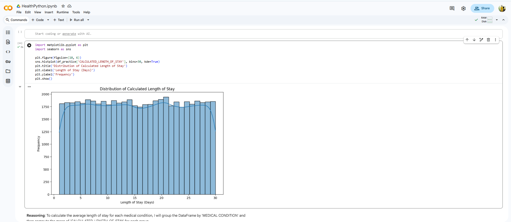
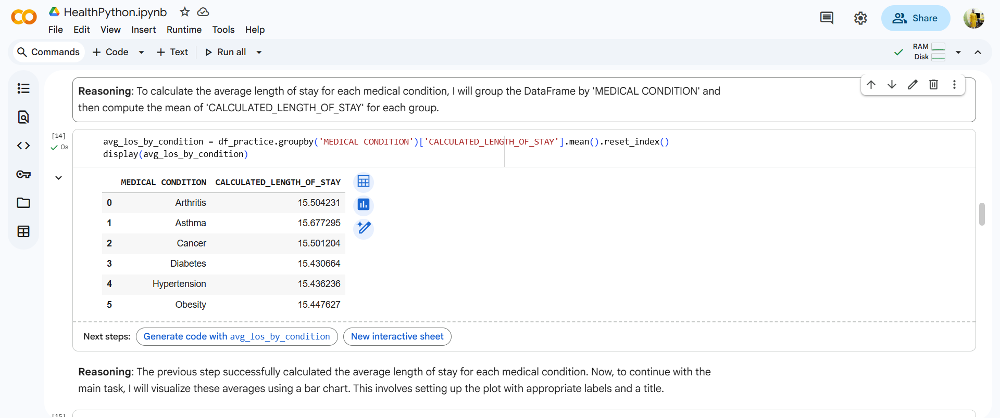
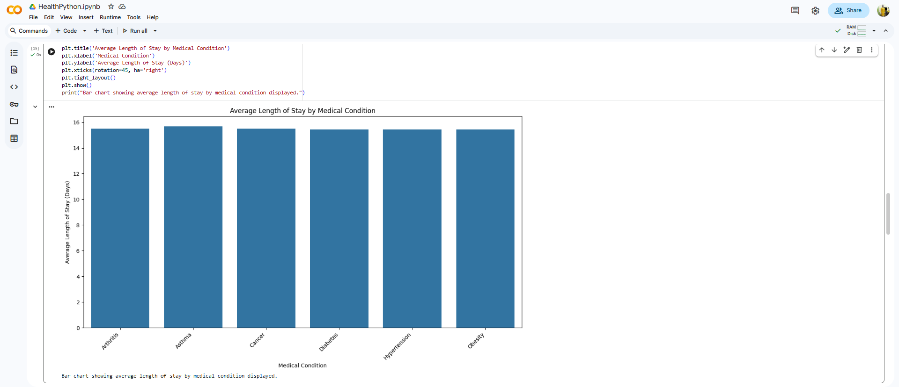
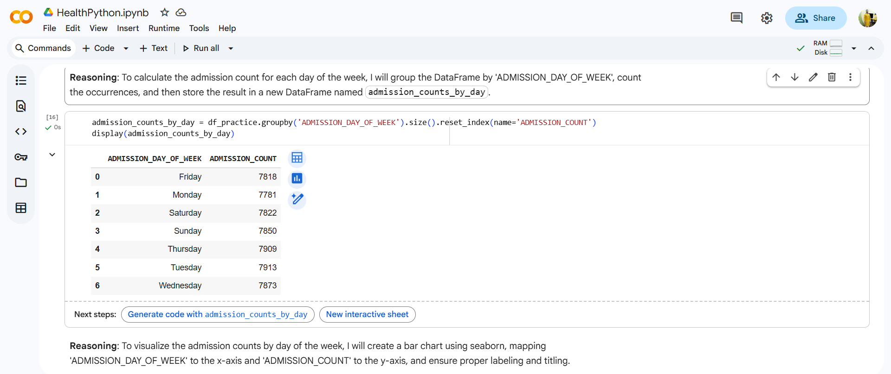
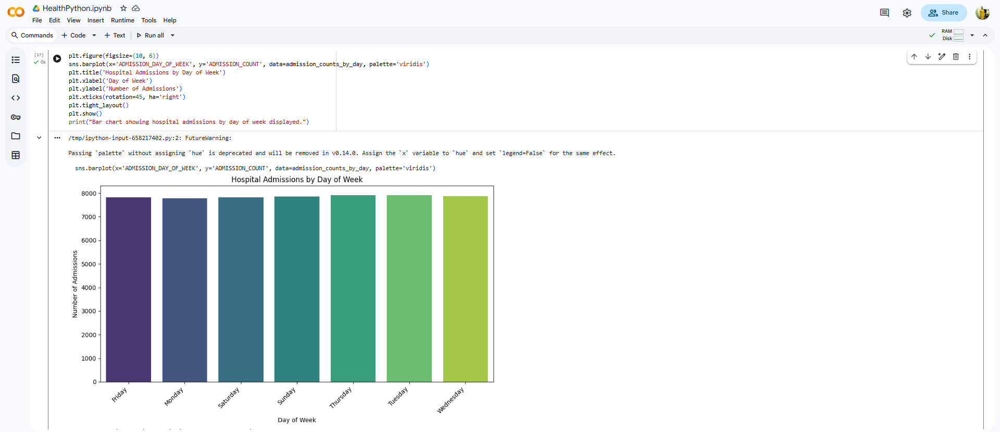

# 🏥 Healthcare Admissions and Length-of-Stay Analysis (Python/EDA) 🐍
## 1. Overview
Conducted an in-depth Exploratory Data Analysis (EDA) using Python to understand patient admission patterns and analyze factors influencing Length of Stay (LOS) in a healthcare setting. The analysis provides operational insights for resource planning and efficiency improvements.

Impactful Code Snippet (Feature Engineering)
This snippet is perfect for showcasing your ability to manipulate datetime objects using the Pandas library:

Python

## Python Snippet: Creating Time-Based Features

### Convert date columns to datetime objects
df_practice['DATE OF ADMISSION'] = pd.to_datetime(df_practice['DATE OF ADMISSION'])
df_practice['DISCHARGE DATE'] = pd.to_datetime(df_practice['DISCHARGE DATE'])

### Calculate the critical Length of Stay metric
df_practice['CALCULATED_LENGTH_OF_STAY'] = (
    df_practice['DISCHARGE DATE'] - df_practice['DATE OF ADMISSION']
).dt.days

## 🎯 Goal
To identify key temporal trends (e.g., peak admission days/months) and statistically characterize the distribution of patient Length of Stay (LOS), informing hospital capacity planning and staffing needs.

## 2. 📊 Exploratory Data Analysis (EDA) & Core Metric Profiling
This section demonstrates the fundamental statistical characterization of the core metric, Length of Stay (LOS), and the calculation of key averages.

### A. Length of Stay Distribution
The initial step involved visualizing the distribution of the calculated CALCULATED_LENGTH_OF_STAY metric to understand its spread and identify potential skewness or outliers.

Result: The histogram shows a relatively uniform distribution across the range of 1 to 30 days, which is critical input for subsequent modeling.

### B. Average LOS by Medical Condition
To understand if certain patient groups require longer hospitalization, the average LOS was calculated and visualized across different medical conditions.

Process: The data was grouped by MEDICAL CONDITION and the mean of CALCULATED_LENGTH_OF_STAY was computed.

Result: The average LOS across the studied conditions is highly consistent (around 15.5 days), suggesting that resource planning should be condition-agnostic based on this metric.

## 3. 🗓️ Operational Temporal Analysis
This analysis focused on identifying operational bottlenecks and resource planning needs by analyzing patient admission trends by the day of the week.

### A. Admission Count by Day of Week
The admission volume was calculated for each day of the week to detect statistically significant variations that impact daily staffing and resource allocation.

Process: The dataset was grouped by ADMISSION_DAY_OF_WEEK and a count of admissions was generated.

Result: The counts for all days of the week are highly balanced (ranging from ~7700 to ~7900), indicating a consistent patient flow that simplifies resource scheduling, as no single day experiences a major surge.

## 4. Tools & Technologies (The Python Stack)
Primary Language: Python 3

Data Manipulation: Pandas (for cleaning and feature engineering)

Numerical Analysis: NumPy

Data Visualization: Matplotlib and Seaborn (for statistical plots)

Environment: Jupyter Notebook / Google Colab (.ipynb)

## 5. Key Actions / Process (EDA & Statistical Analysis)
Data Cleaning & Manipulation: Used Pandas to handle missing data, convert dates, and calculate the CALCULATED_LENGTH_OF_STAY feature.

Temporal Analysis: Analyzed admission data across multiple dimensions:

Year/Month Trends: Identified seasonal fluctuations in patient volume.

Day-of-Week Analysis: Determined if certain days (e.g., Mondays or Weekends) experience statistically significant differences in admission rates.

Statistical Profiling: Performed descriptive statistics on CALCULATED_LENGTH_OF_STAY (mean, median, standard deviation) and visualized its distribution using histograms and bar plots (Section 2).

Hypothesis Generation: Explored correlations between categorical variables (e.g., admission type) and the LOS to generate hypotheses for future predictive modeling.

## 6. Key Achievements & Results
Operational Efficiency: Provided clear, visualized evidence of consistent admission patterns across the week, enabling streamlined staff scheduling based on steady demand.

Statistical Rigor: Demonstrated proficiency in using the fundamental Python data science stack (Pandas, NumPy, Matplotlib) to derive statistical insights from real-world healthcare data.

Foundational Modeling: Created a cleaned, analysis-ready dataset and identified key variables that would serve as the foundation for a future Length of Stay predictive model.
